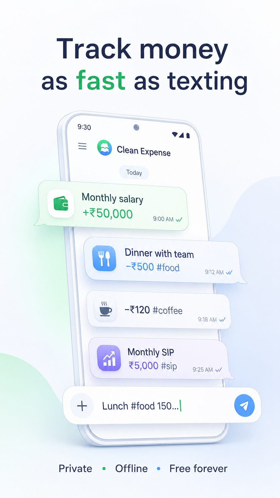
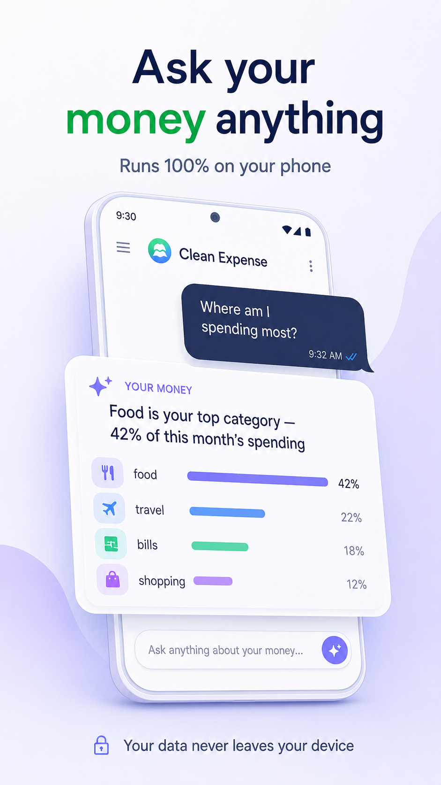
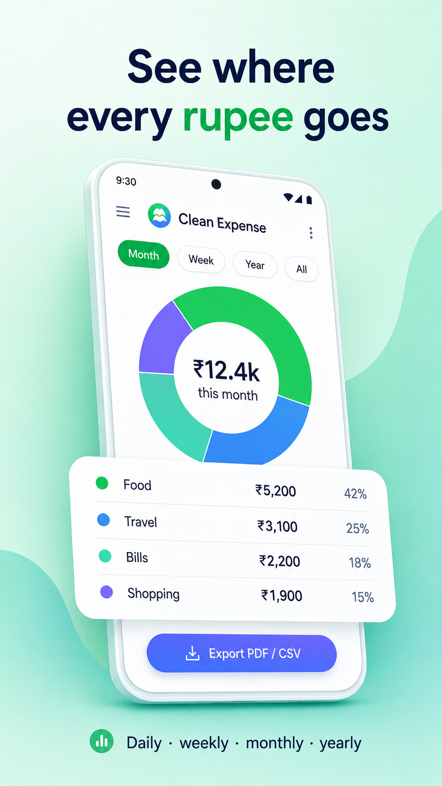
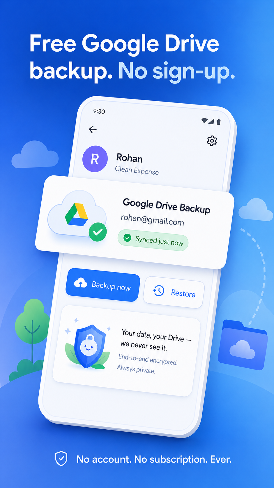
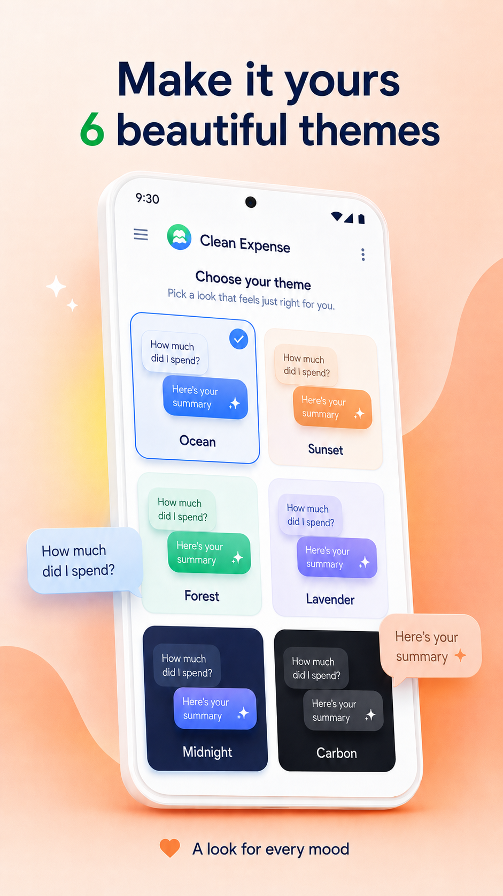
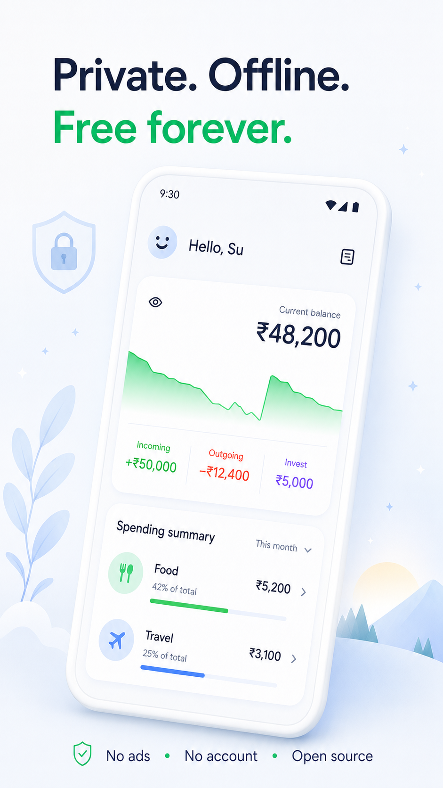

# Clean Expense


**Track your money as fast as sending a text.** Clean Expense is a chat-based
expense tracker with a private, on-device AI assistant, free Google Drive
backup, and beautiful themes — offline-first and free forever.

<p align="center">
  
  
  
  
</p>

<p align="center">
  <a href="https://play.google.com/store/apps/details?id=com.sutechs.expense">
    
  </a>
  &nbsp;
  <a href="https://apps.apple.com/us/app/clean-expense-track-monney/id6757723320">
    
  </a>
</p>

---

## Why Clean Expense

Most expense apps make you tap through forms. Clean Expense lets you just
type — `dinner #food 500` — and you're done. It's fast enough to actually
keep up with, and everything stays on your device unless *you* choose to
back it up.

## Screenshots

<p align="center">
  
  
  
</p>
<p align="center">
  
  
  
</p>

## Features

- **Chat-speed tracking** — log an expense, income, or investment in
  seconds. Type a note, a `#category`, and an amount in any order.
- **Edit and delete** — long-press any bubble to edit or delete it, like a
  chat.
- **On-device AI assistant** — ask "Where am I spending most?" or "Show
  today's transactions" and get answers with charts, from a model that runs
  100% on your phone. Optional, free, and your data never leaves the device.
- **Free Google Drive backup** — back up and sync to your own Google Drive.
  No account with us, no server, no subscription.
- **Insightful stats** — category breakdowns and charts by day, week,
  month, or year.
- **Export** — branded PDF reports and CSV for Excel or Sheets.
- **Six themes** — including a true-black AMOLED mode.
- **Private and offline-first** — works fully offline, no ads, no account
  required, all data stored locally with Hive.

## Built with

Flutter · Provider · Hive CE · fl_chart · flutter_gemma (on-device LLM) ·
googleapis (Drive) · pdf + share_plus (export)

## Getting started

```bash
git clone https://github.com/SuTechs/clean_expense.git
cd clean_expense
flutter pub get
dart run build_runner build
flutter run
```

Everything works out of the box — no keys or accounts needed. The only
optional feature that needs configuration is Google Drive backup.

### Optional: Google Drive backup credentials

No credentials live in this repo. To enable Drive backup in your own build,
create your own free Google OAuth clients — full walkthrough in
[`docs/google-drive-sync-setup.md`](docs/google-drive-sync-setup.md) — then:

1. Copy `env.example.json` to `env.json` (gitignored), fill in your client
   IDs, and build with the define file:

   ```bash
   flutter run --dart-define-from-file=env.json
   ```

2. **iOS only:** copy `ios/Flutter/Secrets.xcconfig.example` to
   `ios/Flutter/Secrets.xcconfig` (gitignored) and set your reversed client
   id. Info.plist picks it up automatically at build time.

Without these files the app builds and runs normally — the backup feature
simply shows as "not configured". OAuth client IDs are public identifiers,
not secrets; keeping them out of the repo just prevents third-party builds
from impersonating the official app's consent screen.

## Roadmap

- [x] Edit and delete expenses
- [x] First-launch onboarding with a live typing demo
- [x] Export to PDF and CSV
- [x] Free Google Drive backup and sync
- [x] On-device AI assistant with generated charts
- [ ] Conversational follow-ups ("what about last month?")
- [ ] Multi-expense entry in one message
- [ ] UPI QR scanner with auto-logging
- [ ] Custom and shareable chat themes

## Demo

[Watch the build walkthrough on YouTube](https://youtu.be/KUim8kCIA4I)

## Contributing

Contributions are welcome. Found a bug or have a feature request? Please
open an issue. Pull requests are appreciated.

## About

Built by [SuTechs](https://sutechs.com). Connect with us on
[LinkedIn](https://linkedin.com/in/su-mit) and
[Instagram](https://instagram.com/sutechs).

## Credits

Huge thanks to [Antigravity](https://antigravity.google/) and
[Claude Code](https://claude.com/claude-code) for the incredible assistance
in building this project.

## License

Copyright © 2026 **SuTechs**. All Rights Reserved.

This project is licensed for personal and educational use only. You are
**not allowed** to redistribute, resell, or upload this app to any app store
(Google Play, App Store, etc.) without explicit permission.
